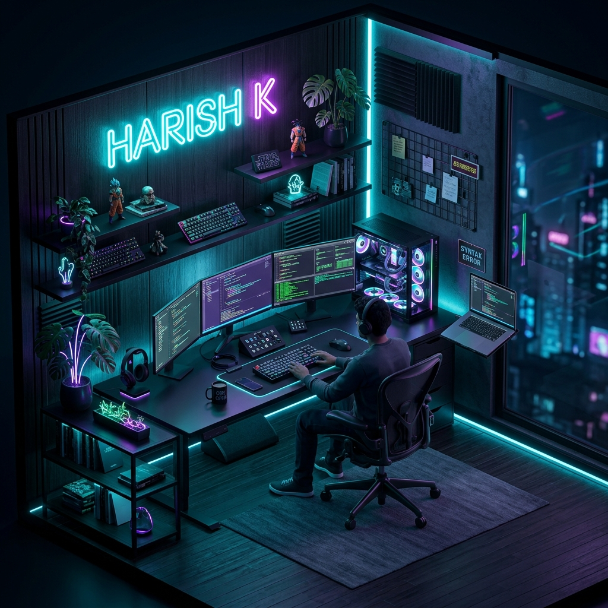

 

  
  
  

---

### 🌐 System Bio

<table align="center" width="100%">
  <tr>
    <td width="30%" align="center">
      
    </td>
    <td width="70%">
      

        <b>HARISH K</b> // <i>Full Stack Developer & Architect</i>
      

      

        Specializing in building high-performance decentralized systems and scalable web architectures. 
        Expertise in modernizing legacy systems and crafting seamless user experiences with a focus on speed and security.
      

      

        🚀 <b>Currently:</b> Engineering SaaS Solutions 
        📍 <b>Base:</b> Dindigul, India 
        🎓 <b>Institute:</b> PSNA College of Engineering
      

    </td>
  </tr>
</table>

---

### 🛠️ Core Technologies

  

 

| **Frontend** | **Backend** | **DevOps** |
| :--- | :--- | :--- |
| React, Next.js, TypeScript | Go, Node.js, Python | AWS, Docker, Kubernetes |
| Tailwind CSS, Framer Motion | MongoDB, PostgreSQL | CI/CD, GitHub Actions |

---

### 📊 Performance Metrics

  
  

  

---

### 🏆 Achievement Log

  <table width="100%">
    <tr>
      <td>
        
🥇 <b>1st Prize</b> — Prompt Engineering

        
🏆 <b>Hackovation 2.0</b> — Winner

        
🚀 <b>SIH 2024</b> — Project Lead

      </td>
      <td>
        
💡 <b>250+ LeetCode</b> Problems

        
👑 <b>Overall Trophy</b> — ELECTROVIBEZ 2K26

        
📑 <b>Paper Presentation</b> — 1st Prize

      </td>
    </tr>
  </table>

---

### 🚀 Deployments

| Status | Project | Stack | Link |
| :---: | :--- | :--- | :---: |
| 🟢 | **Smart Shopping Trolley** | IoT, React, Node.js | [VIEW](https://trolley-frontend-lemon.vercel.app/login) |
| 🟢 | **Clinic Booking System** | MERN, TypeScript | [VIEW](https://clinic-booking-rho.vercel.app/) |
| 🟣 | **Portfolio Website** | React, Framer Motion | [VIEW](https://harish-urcq.vercel.app/) |

---

### 🧱 3D Architecture

  

---

### 🐍 Neural Contributions

  <picture>
    <source media="(prefers-color-scheme: dark)" srcset="https://raw.githubusercontent.com/Harishsbb/Harishsbb/snake-output/github-contribution-grid-snake-dark.svg">
    <source media="(prefers-color-scheme: light)" srcset="https://raw.githubusercontent.com/Harishsbb/Harishsbb/snake-output/github-contribution-grid-snake.svg">
    
  </picture>

 

  

  <b>© 2024 HARISH K | SYSTEM STATUS: OPTIMAL</b>

